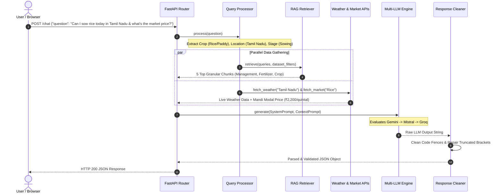

# Stellar Agri AI - System Architecture & Technical Specifications

Stellar Agri AI is an advanced, production-grade agricultural decision support system that combines Retrieval-Augmented Generation (RAG), live external weather & commodity market data, and multi-provider LLM orchestration to deliver farmer-friendly recommendations in structured JSON format.

---

## 🏛️ High-Level Architecture Overview

```mermaid
flowchart TD
    User([Farmer / App User]) -->|HTTP POST Query| Frontend[Vanilla HTML5 / CSS3 / JS UI]
    Frontend -->|POST /chat| FastAPI[FastAPI Backend Server]
    
    subgraph Core Pipeline
        FastAPI --> STEP1[1. Query Processor & Entity Normalizer]
        STEP1 -->|Detected Crop, Location, Growth Stage| STEP2[2. RAG Retriever & TF-IDF Store]
        STEP1 -->|Location & Crop Specs| STEP3[3. Parallel External API Fetcher]
        
        STEP3 --> WeatherAPI[Live Weather API\n(WeatherAPI.com)]
        STEP3 --> MarketAPI[Live Mandi Market API\n(APMC Benchmarks)]
        
        STEP2 -->|Top K Granular Chunks| STEP4[4. Context Builder & Prompt Generator]
        WeatherAPI -->|Weather Forecast| STEP4
        MarketAPI -->|Mandi Prices| STEP4
        
        STEP4 -->|Structured Prompt| STEP5[5. Multi-Provider LLM Fallback Engine]
        
        subgraph LLM Layer
            STEP5 --> Provider1[Primary: Gemini 2.5 Flash]
            Provider1 -- Fail Over --> Provider2[Fallback 1: Mistral AI]
            Provider2 -- Fail Over --> Provider3[Fallback 2: Groq Llama 3.1]
        end
        
        STEP5 -->|Raw Completion| STEP6[6. Response Cleaner & JSON Auto-Repair]
    end
    
    STEP6 -->|Valid Schema JSON| Frontend
    Frontend -->|Render Glassmorphic Widgets| User
```

---

## 🔄 End-to-End Execution Flow Trajectory



---

## 📦 Component Specifications

### 1. Query Processor & Entity Normalizer ([`query_processor.py`](file:///c:/Users/salma/Downloads/stellaragri/backend/app/rag/query_processor.py))
- **Synonym Replacement**: Normalizes terms (e.g., `nitrogen` -> `N`, `potassium` -> `K`, `watering` -> `irrigation`).
- **Entity Extraction**:
  - `crop`: Matches against 16+ agricultural crop families and aliases (e.g., `rice` <-> `paddy`, `dhaan`, `nel`).
  - `location`/`state`: Identifies Indian states and cities.
  - `growth_stage`: Detects stages (`land preparation`, `seed treatment`, `nursery`, `sowing`, `transplanting`, `tillering`, `flowering`, `harvest`).
  - `symptoms`: Detects pest/disease indicators (`yellowing`, `blight`, `rot`, `wilt`, `aphid`, `borer`).
  - `NPK values`: Extracts soil test measurements ($N, P, K$ levels).
- **Intent Scoring**: Intent weights for `crop_recommendation`, `fertilizer`, `disease`, `pest_control`, `weather`, `irrigation`, `market`, and `management`. Boosts specific intent scores when domain keywords (`urea`, `dap`, `price`, `mandi`) are present.
- **Retrieval Query Builder**: Generates multi-alias expanded retrieval queries (e.g., searching both `"rice fertilizer"` and `"paddy fertilizer"`).

### 2. RAG Knowledge Store & Granular Indexer ([`chunker.py`](file:///c:/Users/salma/Downloads/stellaragri/backend/app/rag/chunker.py) & [`retriever.py`](file:///c:/Users/salma/Downloads/stellaragri/backend/app/rag/retriever.py))
- **Row-Level Granular Chunking**: Transforms CSV datasets into focused single-record chunks (3,199 total indexed chunks across 5 datasets).
- **Indexing Engine**: Sublinear TF-IDF vectorization with unigram and bigram ranges (`ngram_range=(1, 2)`).
- **Intent-Aware Priority Boost**: Dynamically boosts retrieved chunks based on intent and crop alias matching:
  $$\text{Final Score} = \text{TF-IDF Cosine Similarity} + \text{Dataset Priority Boost} + \text{Crop Alias Match Boost (+0.15)}$$

### 3. External API Integration Services
- **Weather Service ([`weather_service.py`](file:///c:/Users/salma/Downloads/stellaragri/backend/app/rag/weather_service.py))**: Fetches 7-day weather forecast, precipitation (mm), temperature range, relative humidity, UV index, and computes agricultural risk factors (fungal risk, heat stress, frost risk, irrigation necessity). Includes 15-minute in-memory caching.
- **Market Service ([`market_service.py`](file:///c:/Users/salma/Downloads/stellaragri/backend/app/rag/market_service.py))**: Integrates live Mandi commodity prices with APMC agricultural benchmark fallbacks for modal, minimum, and maximum prices per quintal.

### 4. Multi-Provider LLM Fallback Engine ([`fallback_provider.py`](file:///c:/Users/salma/Downloads/stellaragri/backend/app/llm/fallback_provider.py))
- Automatically cascades through LLM providers if an API key expires, encounters rate limits, or fails:
  1. **Primary**: Google Gemini 2.5 Flash (`gemini/gemini-2.5-flash`)
  2. **Fallback 1**: Mistral AI (`mistral/mistral-small-latest`)
  3. **Fallback 2**: Groq Llama 3.1 (`groq/llama-3.1-8b-instant`)

### 5. Response Cleaner & JSON Auto-Repair ([`response_cleaner.py`](file:///c:/Users/salma/Downloads/stellaragri/backend/app/llm/utils/response_cleaner.py))
- Strips markdown code fences (` ```json `).
- Implements a stack-based JSON repair algorithm that balances quotes, commas, and unclosed brackets (`{`, `[`) to recover truncated responses from token limits.

---

## 🗂️ Knowledge Base Datasets

| Dataset File | Domain | Index Records | Primary Attributes |
|---|---|---|---|
| `Crop_recommendation.csv` | Crop Suitability | 2,200 Chunks | N, P, K, Temperature, Humidity, pH, Rainfall, Label |
| `Fertilizer Prediction.csv` | Fertilizer Advice | 99 Chunks | Soil Type, Crop Type, N, P, K, Fertilizer Name |
| `crop_disease.csv` | Disease Protection | 300 Chunks | Crop, Disease, Symptoms, Favorable Conditions, Diagnosis |
| `crop_pest.csv` | Pest Control | 300 Chunks | Crop, Pest, Symptoms, Pesticide Recommendation |
| `crop_management.csv` | Agronomy Practices | 300 Chunks | Crop, Growth Stage, Activity, Recommended Practice |

---

## 📋 JSON Output Schema Specification

Every response conforms strictly to this JSON format:

```json
{
  "summary": "String (Executive Overview)",
  "intent": "String (crop_recommendation | fertilizer | disease | pest_control | weather | market | management)",
  "confidence": "Float (0.0 to 1.0)",
  "answer": ["Array of bulleted key recommendations"],
  "crop_recommendation": {
    "crop": "String or null",
    "confidence": "Float or null",
    "reason": "String or null"
  },
  "disease_analysis": {
    "disease": "String or null",
    "symptoms": ["Array of symptoms"],
    "recommendation": "String or null"
  },
  "pest_analysis": {
    "pest": "String or null",
    "recommendation": "String or null"
  },
  "fertilizer_advice": {
    "recommended": ["Array of fertilizers or structured objects"],
    "application": "String or null"
  },
  "irrigation_advice": {
    "schedule": "String or null",
    "recommendation": "String or null"
  },
  "crop_management": {
    "growth_stage": "String or null",
    "recommendation": "String or null"
  },
  "weather_analysis": {
    "impact": "String or null",
    "recommendation": "String or null"
  },
  "market_analysis": {
    "current_price": "String / Object or null",
    "recommendation": "String or null"
  },
  "warnings": ["Array of warning alerts"],
  "next_steps": ["Array of actionable next steps"]
}
```
