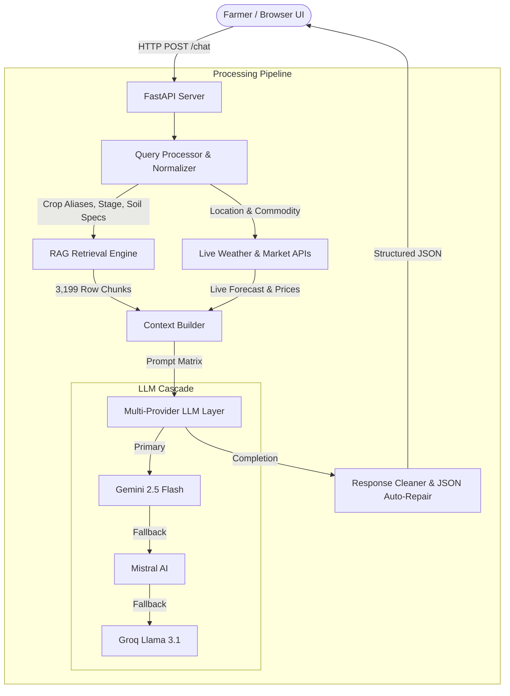

# 🌾 Stellar Agri AI - Smart Agricultural Advisory System


**Stellar Agri AI** is an intelligent, agentic decision-support platform designed to assist farmers, agronomists, and agricultural advisors. It combines **Retrieval-Augmented Generation (RAG)** over curated agricultural knowledge bases, **Live 7-Day Weather Forecasting**, and **Live Mandi Commodity Market Prices** with a multi-provider LLM fallback engine (**Gemini 2.5 Flash**, **Mistral AI**, and **Groq Llama 3.1**).

---

## 🌟 Key Features

- 🌾 **Smart Crop Recommendation**: Recommends optimal crops based on soil nutrients ($N, P, K$ levels), pH, rainfall, and climate.
- 🧪 **Fertilizer Guidance**: Provides exact fertilizer selection (Urea, DAP, 28-28, NPK mixtures) and application schedules.
- 🛡️ **Pest & Disease Diagnosis**: Detects crop diseases and pest infestations from reported symptoms and provides treatment strategies.
- 🌧️ **Live Weather & Risk Forecasting**: Fetches real-time local weather forecasts and evaluates agricultural risks (fungal infection risk, heat stress, irrigation necessity).
- 📈 **Mandi Market Price Analysis**: Provides live and benchmark mandi commodity prices (Minimum, Maximum, and Modal price per quintal) to advise optimal selling timing.
- 🔄 **Multi-Provider LLM Fallback**: Seamless automatic failover between **Gemini**, **Mistral**, and **Groq** if any API key is rate-limited or unavailable.
- 💻 **Framework-Free Premium UI**: Glassmorphic, modern Vanilla HTML5/CSS3/JS user interface with zero dependencies on external frontend frameworks or hero images.

---

## 🏛️ System Architecture Flow



> 📖 *For full mathematical, indexing, and sequence specs, see [ARCHITECTURE.md](file:///c:/Users/salma/Downloads/stellaragri/ARCHITECTURE.md).*

---

## 📁 Project Directory Structure

```text
stellaragri/
├── index.html                  # Main Web Application Page (Vanilla HTML5)
├── netlify.toml                # Netlify Static Deployment Config
├── render.yaml                 # Render 1-Click Infrastructure Blueprint
├── docker-compose.yml          # Docker Compose Services
├── DEPLOYMENT.md               # Step-by-Step Deployment Documentation
├── ARCHITECTURE.md             # Detailed Technical Architecture Specifications
├── README.md                   # Project Overview & Setup Instructions
│
├── frontend/                   # Frontend Assets & Logic
│   ├── css/
│   │   ├── style.css           # Core Design System (CSS Custom Properties & Glassmorphism)
│   │   └── responsive.css      # Mobile & Tablet Media Queries
│   ├── js/
│   │   ├── config.js           # API Endpoints Configuration
│   │   ├── api.js              # Fetch Service & Retry Fallback Logic
│   │   ├── ui.js               # Dynamic JSON Card & Widget Renderer
│   │   └── app.js              # Main UI Event Controller
│   └── pages/
│       └── dashboard.html      # Dashboard Entry Point
│
├── backend/                    # FastAPI Application Server
│   ├── Dockerfile              # Production Multi-Stage Dockerfile
│   ├── requirements.txt        # Python Dependencies
│   ├── .env                    # Environment Variables & API Keys
│   ├── uploads/                # Agricultural CSV Datasets (Crop, Fertilizer, Disease, Pest, Management)
│   ├── storage/                # Persisted TF-IDF Vectorizer & Matrix Index
│   └── app/
│       ├── main.py             # FastAPI App Entrypoint & Static Serving
│       ├── core/               # App Settings & Logging Configuration
│       ├── routes/             # API Endpoints (/chat, /health, /)
│       ├── services/           # Chat & Advisory Business Logic
│       ├── rag/                # RAG Indexer, Chunker, QueryProcessor & Retrievers
│       ├── llm/                # LLM Engine, Fallback Router & Response Cleaner
│       │   └── providers/      # Gemini, Mistral, and Groq Provider Implementations
│       └── evaluation/         # RAG Benchmark Evaluator & Test Suite
```

---

## 🚀 Quick Start Guide

### Prerequisites
- Python 3.11+
- Virtual environment (`venv`)

### 1. Installation
```bash
# Clone the repository
git clone https://github.com/YOUR_USERNAME/stellaragri.git
cd stellaragri/backend

# Create & activate virtual environment
python -m venv venv
# On Windows:
venv\Scripts\activate
# On Linux/macOS:
source venv/bin/activate

# Install dependencies
pip install -r requirements.txt
```

### 2. Configure Environment Variables (`.env`)
Create or update `backend/.env`:
```env
# AI API Keys
GEMINI_API_KEY=your_gemini_api_key
MISTRAL_API_KEY=your_mistral_api_key
GROQ_API_KEY=your_groq_api_key

# Models
GEMINI_MODEL=gemini-2.5-flash
MISTRAL_MODEL=mistral/mistral-small-latest
GROQ_MODEL=llama-3.1-8b-instant

# Live External APIs
WEATHER_API_KEY=59595d305ea74112b9c105207261907
```

### 3. Run the Backend Server
```bash
# From the backend/ directory:
python -m uvicorn app.main:app --host 127.0.0.1 --port 8000 --reload
```

### 4. Launch the Web Application
Open your web browser and navigate to:
👉 **[http://127.0.0.1:8000](http://127.0.0.1:8000)** (or double-click [index.html](file:///c:/Users/salma/Downloads/stellaragri/index.html)).

---

## 📡 API Reference

### `GET /health`
Returns system status.
```json
{
  "status": "healthy"
}
```

### `POST /chat`
Submits a query to the agricultural advisory engine.

**Request Body**:
```json
{
  "question": "Which fertilizer should I use for rice in clayey soil?"
}
```

**Response**:
```json
{
  "summary": "Urea is recommended for Paddy (rice) in clayey soil based on Nitrogen requirements.",
  "intent": "fertilizer",
  "confidence": 1.0,
  "answer": [
    "Apply Urea for rice grown in clayey soil requiring high Nitrogen levels (35-39)."
  ],
  "fertilizer_advice": {
    "recommended": ["Urea"],
    "application": "Apply Urea as per prescribed nitrogen dosage during land preparation and tillering."
  },
  "crop_recommendation": null,
  "disease_analysis": null,
  "pest_analysis": null,
  "weather_analysis": null,
  "market_analysis": null,
  "warnings": [],
  "next_steps": []
}
```

---

## 🌐 Production Deployment

Refer to **[DEPLOYMENT.md](file:///c:/Users/salma/Downloads/stellaragri/DEPLOYMENT.md)** for complete deployment guides on:
- **Render.com** (1-Click Blueprint with `render.yaml`)
- **Docker & Docker Compose** (`docker-compose up -d --build`)
- **Netlify & Vercel** (Static UI Deployment)

---

## 📄 License
Licensed under the [MIT License](LICENSE).
