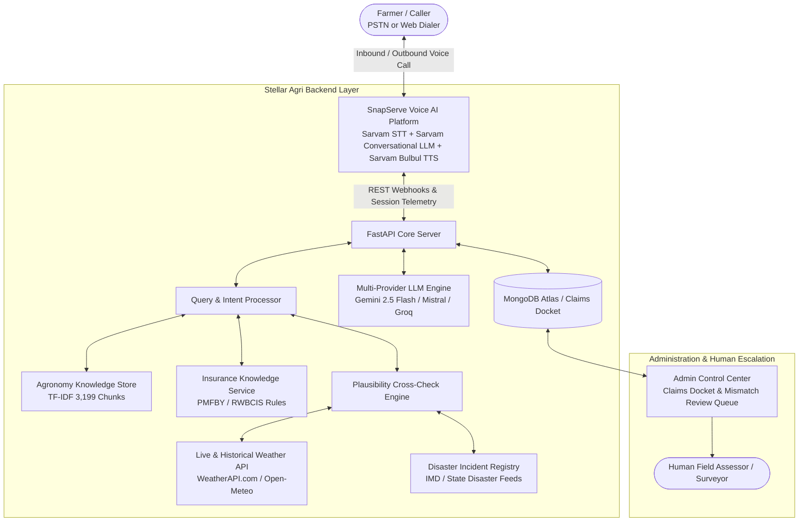

# Voistle Round 2: Crop Insurance & Farmer Voice AI Deliverables

This document contains the complete architectural specifications, guardrail design, test conversation transcripts, and 3-minute judging pitch script for **Stellar Agri AI** in **Voistle Round 2**.

---

## 🏛️ 1. Architecture Overview



### Telephony & Speech Stack:
- **ASR / STT**: Sarvam AI (`saaras:v3-realtime`) with background denoising and live endpointing for 10 Indic languages.
- **LLM Brain**: Sarvam 105B Conversational Model with server-side fallbacks (Gemini 2.5 Flash, Mistral Small).
- **TTS Voice**: Sarvam Bulbul v3 (`ritu` voice) with conversational prosody and micro-backchanneling.
- **Telephony Provider**: Vobiz PSTN carrier routing to active phone DID `+918071581407` (Permanent Agent `#1028`).

---

## 🛡️ 2. Guardrails & Safety Documentation

### A. Anti-Overpromising Guardrails (Core Judging Gate)
The agent strictly adheres to refusal patterns whenever a caller asks *"Will I get money?"*, *"How much will I get?"*, or *"When will it come?"*:
1. **Zero Financial Guarantees**: The agent never commits to approval, a specific payout amount, or a guaranteed payout date.
2. **Standard Deflection Pattern**:
   > *"Under PMFBY guidelines, compensation is determined exclusively following a joint physical field survey by the insurance assessor and state agriculture officer. I have registered your claim intimation and your docket is queued for surveyor assessment."*
3. **Strict Out-of-Scope Refusal**: The agent never provides legal advice, private loan guidance, or recommendations to sell land.

### B. Meteorological Plausibility & Fraud Prevention
1. **Real-time Anomaly Detection**: When a farmer reports a loss event (e.g. flash flood), the Plausibility Engine cross-checks the declared date and district with real-time precipitation records.
2. **Non-Accusatory Escalation**: If an anomaly is detected (e.g. 0mm rain during claimed flood), the agent does **not** accuse the caller of fraud. Instead, it states:
   > *"I have noted your reported flood damage for your village. To ensure your claim is processed accurately, I am attaching our Mandal weather telemetry notes and forwarding your file directly to our senior agricultural desk for physical verification."*

### C. Conversational Empathy & Pacing
- **One Question at a Time**: Ensures low-literacy callers are never overwhelmed with multi-part questions.
- **Dialect Code-Switching**: Seamlessly blends regional vernacular (*Nel, Payir, Chitta, Patta, Thoppu, Khasra, Khatauni*) with English technical terms.
- **Distress De-escalation**: If the farmer expresses acute distress or explicitly demands a human officer, the agent immediately expresses empathy and triggers human escalation.

---

## 🎙️ 3. Test Conversation Scenarios & Transcripts

### Scenario 1: Straightforward Valid Claim (Cyclone Michaung Paddy Loss)
- **Caller**: Tamil-speaking farmer from Cuddalore reporting submerged Samba paddy.
- **Language**: Tamil + English Agricultural code-switching (`ta-IN`).

```text
[Agent #1028]: Vanakkam! Naan Stellar Agri AI vivasaya aalochagar pesugiren. Ungalukku payir, uram, nooi kattuppaadu matrum PMFBY bima pathiya vivaram enna thevai?
[Farmer]: Vanakkam sir. Enga Cuddalore Kurinjipadi la Cyclone Michaung mazhaila 4 acre Samba nel muzhusa thaanila moozhiduchu. Bima claim panna mudiyuma?
[Agent #1028]: Kavalapadadhinga aiya. Cyclone Michaung inundation PMFBY localized calamity kizh varum. Mazhai vandhu 72 hours-kulla claim intimation kudukkanum. Indha event eppo nadanthadhu?
[Farmer]: Rendu naal munnadi sir, Tuesday night.
[Agent #1028]: Romba nalladhu aiya, 72 hours window-kulla irukku. Unga kitta Patta/Chitta land record, VAO Sowing Certificate, Bank passbook copy, matrum phone-la edutha crop photo irukka?
[Farmer]: Ellam irukku sir. Enakku evvalavu panam kidaikkum sir? Kandippa approve aagiduma?
[Agent #1028]: PMFBY vidhimuraipadi, compensation amount field-la insurance assessor matrum velanmai thurai officer neradi aaiyvu senji dhaan mudivu pannuvanga. Naan ungaludaiya claim intimation docket register pannitten. Surveyor ungalai 10 naalukkul thodarbu kolvar.
```

---

### Scenario 2: Data Mismatch & Plausibility Flag (Reported Flood during Drought)
- **Caller**: Farmer reporting flood in Beed, Maharashtra during documented dry spell.
- **Language**: Hindi (`hi-IN`).

```text
[Agent #1028]: Namaste! Main Stellar Agri AI se bol raha hoon. Fasal, beemari, ya PMFBY bima claim se judi kya madad chahiye aapko?
[Farmer]: Namaste. Mere Beed district mein khet mein kal achanak bhari baadh aa gayi aur 3 acre soybean poori tarah doob gaya. Mujhe turant compensation chahiye.
[Agent #1028]: Kisan bhai, fasal ke nuksan ke baare mein sunkar dukh hua. Humare meteorological records ke mutabiq aapke kshetra mein pichle 15 dinon se sookha aur tez dhoop darj hui hai. Kya yeh nuksan kisi local canal breach ya borewell overflow se hua hai?
[Farmer]: Nahi nahi, baadh aayi thi! Aap seedha claim pass karo na!
[Agent #1028]: Bhai sahib, PMFBY niyamon ke tahat har claim ka mandal weather data se milan kiya jata hai. Main aapka intimation docket darj kar raha hoon aur isme local station notes jodkar hamare senior district officer ko priority physical review ke liye bhej raha hoon. Woh aapse sampark karenge.
```

---

### Scenario 3: Emotional / Distressed Caller with Human Escalation
- **Caller**: Highly distressed farmer under financial anxiety.
- **Language**: Hindi-English blend (`hi-IN`).

```text
[Agent #1028]: Namaste! Main Stellar Agri AI farming advisor bol raha hoon. Main aapki kya sahayata kar sakta hoon?
[Farmer]: (Anxious/Crying) Meri poori kapas ki fasal keede ne barbaad kar di! Bank ka karza sar pe hai, main kya karoon, mujhe kisi officer se baat karni hai abhi ke abhi!
[Agent #1028]: Kisan bhai, kripya bilkul chinta mat kijiye, hum poori tarah aapke sath hain. Main turant aapki call ko hamare Senior Agricultural Support Officer ko escalate kar raha hoon. Kripya line par bane rahiye, officer aapse baat karenge.
[System Action]: Escalation ticket generated in Admin Dashboard #CLM-612840, High Priority flag set.
```

---

### Scenario 4: Natural Code-Switching & Dialect Query
- **Caller**: Telugu farmer mixing English terms (*spraying, fertilizer dosage, claim*).
- **Language**: Telugu + English (`te-IN`).

```text
[Agent #1028]: Namaskaram! Nenu Stellar Agri AI vyavasaya salahadarunini. Panta, eruuvulu, roga niyantrana mariyu PMFBY bima gurinchi emaina sahayam kaavala?
[Farmer]: Hello sir, ma field Nellore lo undi. Recent heavy rainfall valla paddy crop lo yellowing vachindi, and konchem lodging kuda ayindi. Spraying cheyocha leka insurance claim pettala?
[Agent #1028]: Namaskaram! Chala manchi question adigaru. Modataga, rain water stagnation unte water ni ventane drain cheyandi. Lodging 33% kante ekkuva unte, PMFBY kinda 72 hours lo intimation ivvandi. Fasal health kosam 1% Urea + Zinc spray cheyavachu.
```

---

## 🎤 4. Three-Minute Pitch Script

**Slide 1: Problem & The Reality of Rural Farmers (0:00 - 0:45)**
> *"Good afternoon, Judges. In India, over 140 million farmers face catastrophic weather events every year. But when disaster strikes, filing a PMFBY crop insurance claim is a nightmare of paperwork, confusing timelines, and rigid portals. When distressed farmers call hotlines, they speak in regional dialects with low literacy, often falling prey to either unresponsive IVRs or hallucinations that promise false payouts."*

**Slide 2: What Makes Stellar Agri AI Different (0:45 - 1:45)**
> *"Stellar Agri AI is an empathetic Voice AI Agronomist & PMFBY Claims Specialist. We built three core capabilities into this platform:
> 1. **Live Meteorological Plausibility Engine**: When a farmer reports a loss, our agent doesn't take claims blindly at face value. It cross-checks the incident date and district against live and historical weather radar feeds to compute a real-time plausibility score.
> 2. **Ironclad Anti-Overpromising Guardrails**: Our agent never commits to payout sums or timelines. It accurately collects the 5 mandatory evidence records (*Patta/Chitta*, sowing certificates, geo-tagged photos) and routes the docket directly to authorized surveyors.
> 3. **Native Dialect & Code-Switching**: Built on Sarvam AI with permanent telephony DID `+918071581407`, it speaks natural conversational Hindi, Tamil, Telugu, and Kannada with 1-question-at-a-time rural empathy."*

**Slide 3: One Design Decision We Are Proud Of (1:45 - 2:30)**
> *"The design decision we are most proud of is our **Non-Accusatory Anomaly Escalation Protocol**. When the system detects a mismatch between claimed flood damage and a dry weather station, it never antagonizes the farmer. Instead, it captures the claim, attaches telemetry telemetry notes, and seamlessly routes it to the human field officer's docket in our Admin Console for verification."*

**Conclusion & Live Demo Call (2:30 - 3:00)**
> *"Our Voice Agent (ID #1028) is live right now on `+918071581407`. Let's place a live code-switched call to see it in action. Thank you!"*
